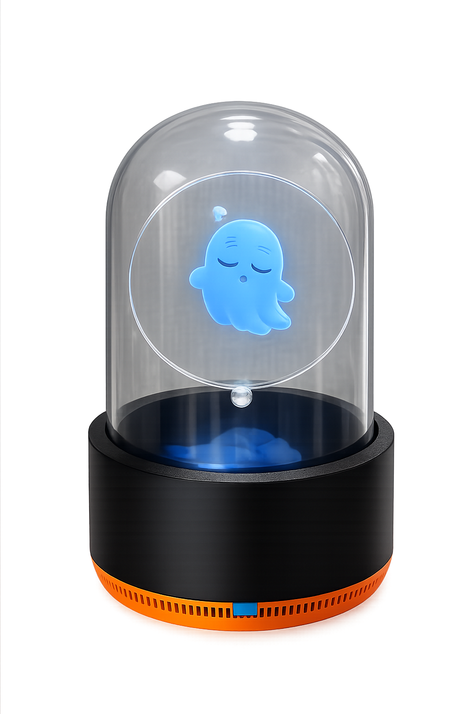

# Pepper
Pepper는 Pepper's Ghost 기법을 활용한 데스크톱 투명 디스플레이 프로젝트입니다.
약 100달러 이하의 예산으로, 주변 소음 크기에 따라 캐릭터가 `sleepy / work / dizzy` 상태로 반응하도록 설계했습니다.

## 주요 기능
- 마이크 입력으로 실시간 소음 레벨(dB SPL 추정) 측정
- LVGL 애니메이션 프레임 전환으로 상태 표현
- ESP32-P4 기반 원형 디스플레이에서 동작

## BOM
- 3.4인치 원형 디스플레이 + ESP32-P4 보드
  - Waveshare: https://www.waveshare.com/esp32-p4-wifi6-touch-lcd-3.4c.htm?sku=31523
- 유리 돔 (`10cm` 지름 x `19cm` 높이)
  - AliExpress: https://s.click.aliexpress.com/e/_c313njhZ
- 타원형 아크릴 패널 (도면)
  - `hardware/타원 아크릴_50degree.DXF`
- 3D 프린트 케이스
  - `hardware/바닥면 구조물.STL`
  - `hardware/case_top.stl`

## Firmware Quick Start
`firmware/` 디렉토리에서 실행:

```bash
idf.py set-target esp32p4
idf.py build
idf.py flash monitor
```

권장 환경: ESP-IDF 5.5.x (`dependencies.lock` 기준 5.5.2).

## 저장소 구조
- `firmware/`: ESP-IDF 프로젝트 (펌웨어 코드, 설정, 컴포넌트 의존성)
- `hardware/`: 제작용 하드웨어 파일 (DXF, STL 등)
- `docs/`: 문서
- `media/`: 이미지 및 미디어 자산

## Roadmap
1. AI 기반 상호작용 버전
2. 소형 버전

## Reference
- Original inspiration: https://www.veeb.ch/projects/the-valley-beneath-the-pepper-dome
